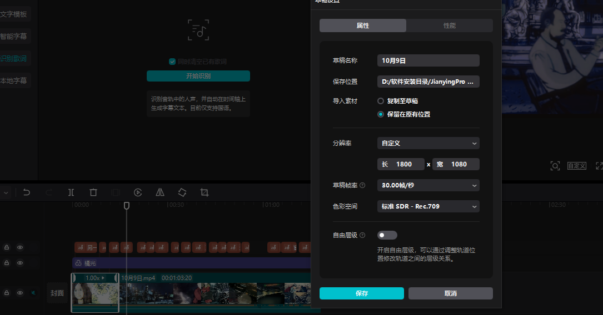
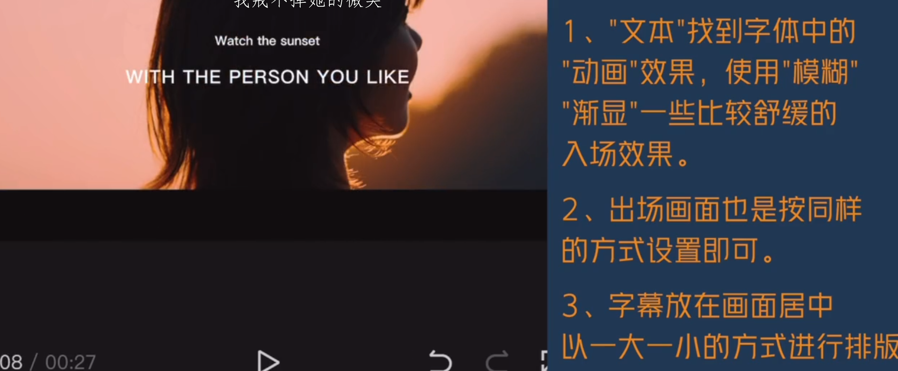
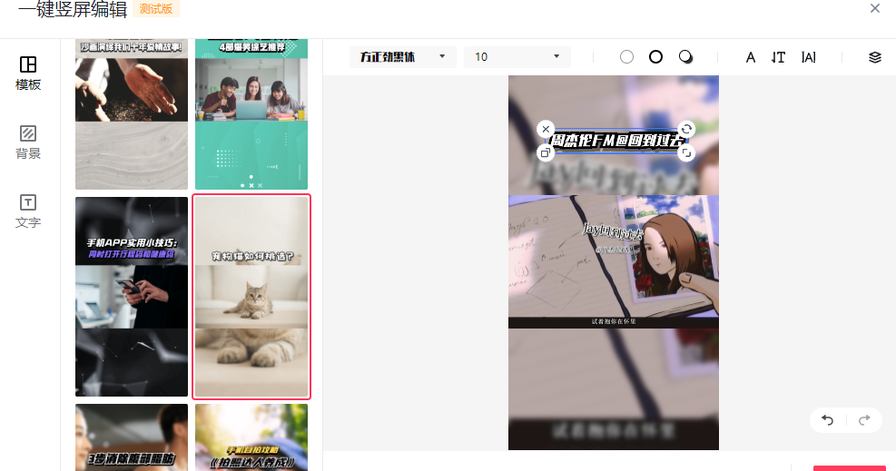

# 如何剪辑黄昏氛围感

1.选用音乐以舒缓，治愈，浪漫

2.选用适合的滤镜，比如在夕阳的时候选用橘黄色的滤镜，在滤镜中找到风景，选择聚光，把黄面变成暖色，让夕阳的色彩更加突出

3.画幅比列的使用，使用剪映的电影效果。模拟成电影效果，把歌词放在黑色边框上面，

画幅比列

文本找到字体中的动画效果，使用模糊，渐显一些比较舒缓的入场效果。

出厂画面也是同样的方式设置即可。字幕放在画面居中以一大一小的方式进行排版

同样做一个渐渐地进出和进入地效果

> 更新: 2023-11-27 16:23:29  
> 原文: <https://www.yuque.com/lixinsi/asq2k8/lbg8gg>