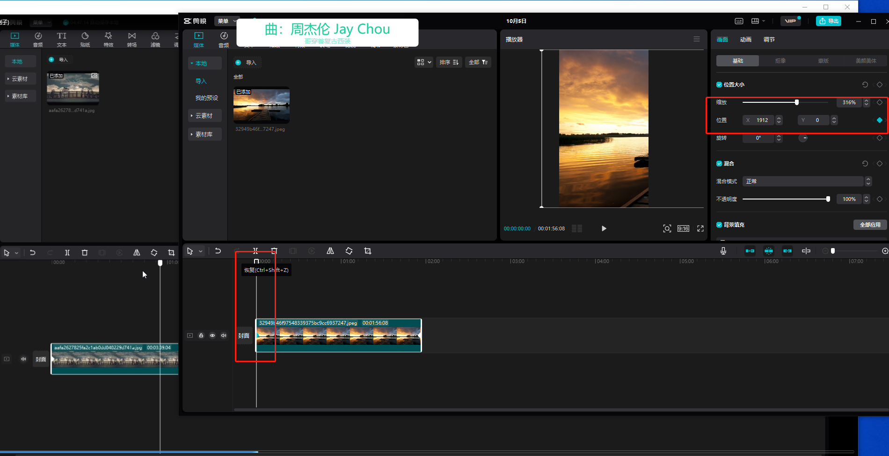
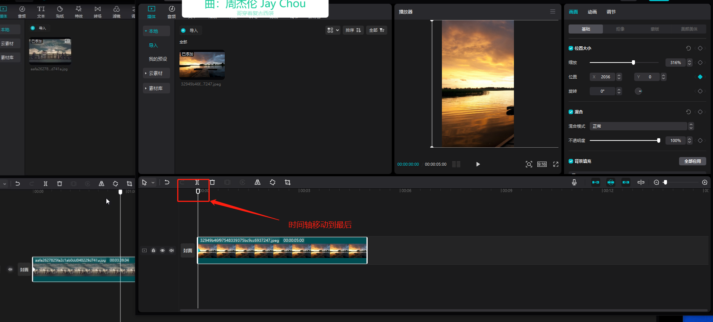
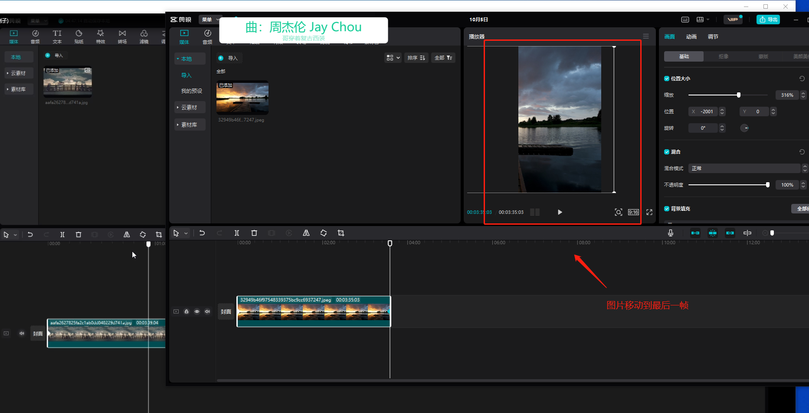
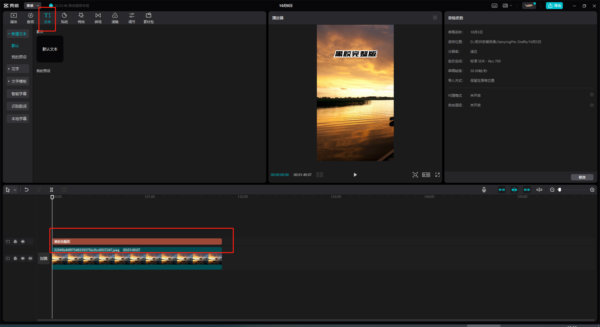

# 音乐号直播

8090音乐号（参考）

课程大纲  
一：直播板块  
1.思路：做直播间流量，在线人数以及场观（直播观看人数）。变现方式（星途任务，音浪，教学，合作）  
2. 所需软件：直播伴侣，OBS（studio版本），歌词插件助手（月卡12元），酷狗音乐播放器（需要开会员）。  
3. 画面素材：西瓜视频上搜索：万人演唱会（找素材用）  
4. 音乐素材：酷狗播放器（无损音质）

课程实操（ps账号搭建）  
一：直播板块  
1.安装所需软件（如上）  
电脑系统，Windows10以上最好  
2.软件使用  
打开酷狗（先播放音乐，调整字体）→打开OBS添加歌词与素材（歌词无法显示，就说明需要登录账号）→打开直播伴侣  
3.直播素材制作  
找到万人演唱会素材，不能把台上的明星给弄下来了→剪映专业版二次创作

导入图片

ctrl+滑轮把图片时间拉长到一分钟

在图片的打上第一帧

现在图片就可以移动了成为了视频

添加文字

添加可视化贴纸

直播思路（重点）：  
1.直播间搭建：制作的画面素材，以及使用的字体，包括歌词使用的字体，一定要搭配美观（自己一定要觉得好看），千万不要和别人的重复，抖音后台会检测！  
2.直播间歌单：同8090后适合大众的音乐，比如周杰伦，林俊杰，SHE，等！  
3.挂小风车：挂小风车目的在于防止抖音不推流，有些账号播十分钟就不能投放抖加了，挂上小风车，可以使直播时间拉长，让更多用户进入直播间，抖音更快识别直播间对应的人群直播时长：新号出去，所需要1000粉丝，并且实名，才能开播，  
初期：刚开始直播，白天早上直播，一场直播尽量保持8小时以上，不管他能不能投放抖加，不管直播间有没有人，在线人数即是是0人，也要保持直播开8小时以上，之后暂停10分钟，再开第二场直播，如此循环。  
中期：当你直播间，在线人数，突破100人的时候，可适当缩短直播时长，每一场保持5小时以上，下播后暂停10分钟再开播。  
后期：直播间在线人数突破1000以上时，每一场直播保持两小时以上即可，不掉抖加的情况下，可以一直挂着直播。直播间突破2000人以上时，直播可以一个小时后下播，不掉抖加的情况下，保持一直挂着，五六个小时开一场！

注意：挂小风车，得直播3场，满足25分钟，才能挂小风车，挂小风车任务去  
抖音搜索：巨量星图-----达人-----内容类型选择抖音直播，看看有没有任务，接了任务之后  
直播伴侣星图任务就有选项了！  
第二种挂小风车方法：认证企业抖音号，认证到蓝V付费600那里就不缴费了，然后去登录电脑端:e.douyin.com   直播管理 里面有个直播小卡片，新建一个小卡片，就属于自己的企业小风车了，不掉抖，很稳！  
第三种：场观达到了10万以上层级，挂50元1张流量卡，发巨量星图里面的账户管理有个星图ID，发ID给我，我给你派流量卡任务！

> 更新: 2022-10-06 10:34:29  
> 原文: <https://www.yuque.com/lixinsi/asq2k8/xw6n1y>