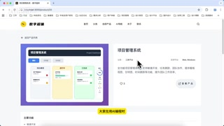

# 前端精准定位问题的方法

# [分享一种让AI精准定位问题的方法_在和朋友交流的过程中，发现](https://bibigpt.co/new/video?url=https%3A%2F%2Fbibigpt-files.oss-cn-beijing.aliyuncs.com%2F2fb6996e-2c49-4aca-9e5e-992416d47240%2F5YiG5Lqr5LiA56eN6K6pQUnnsr7lh4blrprkvY3pl67popjnmoTmlrnms5Vf5Zyo5ZKM5pyL5Y-L5Lqk5rWB55qE6L-H56iL5Lit77yM5Y-R546wXzcyMHAtbXA0LWVuY29kZWQ%3D.mp3)

## 摘要
+ 本视频分享了一种有效提升AI编程时问题定位准确性的方法。作者发现AI在处理前端问题时常出现定位不准、效率低下等问题，经过多种尝试后，最终固定并推荐使用浏览器开发者工具来定位界面元素的容器类名。通过将页面信息和精确的容器类名提供给AI，可以显著提高AI理解和解决问题的能力，从而节省时间和资源。

### 亮点
+ 💡 **问题背景：** 视频指出AI在编程，特别是前端问题处理中，常因定位不准而导致“瞎操作”，浪费时间和计算资源（token）。
+ 🛠️ **核心方法：** 提出并详细讲解了利用浏览器开发者工具（如F12）来精准定位界面元素的“容器类名”作为解决问题的核心策略。
+ 🎯 **原理阐述：** 强调界面元素都包含在容器盒子里，将容器的类名提供给AI是描述界面问题最准确的方式，能帮助AI理解问题发生的具体上下文。
+ 🖥️ **操作步骤：** 演示了具体的操作流程，包括在浏览器中打开开发者工具、选择元素、复制其class类名，然后将页面和类名信息输入给AI，并描述问题。
+ ✅ **效果验证：** 通过一个实际案例（点赞数未正确获取）展示了该方法如何帮助AI成功修复问题，将点赞数从0更新为3，证明了其有效性。
+ [#AI编程](https://bibigpt.co/search?q=AI%E7%BC%96%E7%A8%8B) [#前端开发](https://bibigpt.co/search?q=%E5%89%8D%E7%AB%AF%E5%BC%80%E5%8F%91) [#问题定位](https://bibigpt.co/search?q=%E9%97%AE%E9%A2%98%E5%AE%9A%E4%BD%8D) [#开发者工具](https://bibigpt.co/search?q=%E5%BC%80%E5%8F%91%E8%80%85%E5%B7%A5%E5%85%B7) [#效率提升](https://bibigpt.co/search?q=%E6%95%88%E7%8E%87%E6%8F%90%E5%8D%87)

### 思考
1. [这种方法是否适用于所有类型的AI编程助手，或者主要针对特定的AI模型或平台？](https://bibigpt.co/search?q=%E8%BF%99%E7%A7%8D%E6%96%B9%E6%B3%95%E6%98%AF%E5%90%A6%E9%80%82%E7%94%A8%E4%BA%8E%E6%89%80%E6%9C%89%E7%B1%BB%E5%9E%8B%E7%9A%84AI%E7%BC%96%E7%A8%8B%E5%8A%A9%E6%89%8B%EF%BC%8C%E6%88%96%E8%80%85%E4%B8%BB%E8%A6%81%E9%92%88%E5%AF%B9%E7%89%B9%E5%AE%9A%E7%9A%84AI%E6%A8%A1%E5%9E%8B%E6%88%96%E5%B9%B3%E5%8F%B0%EF%BC%9F)
2. [如果一个界面元素没有明确的容器类名，或者其类名是动态生成的，这种方法是否还有效，或者是否有替代方案？](https://bibigpt.co/search?q=%E5%A6%82%E6%9E%9C%E4%B8%80%E4%B8%AA%E7%95%8C%E9%9D%A2%E5%85%83%E7%B4%A0%E6%B2%A1%E6%9C%89%E6%98%8E%E7%A1%AE%E7%9A%84%E5%AE%B9%E5%99%A8%E7%B1%BB%E5%90%8D%EF%BC%8C%E6%88%96%E8%80%85%E5%85%B6%E7%B1%BB%E5%90%8D%E6%98%AF%E5%8A%A8%E6%80%81%E7%94%9F%E6%88%90%E7%9A%84%EF%BC%8C%E8%BF%99%E7%A7%8D%E6%96%B9%E6%B3%95%E6%98%AF%E5%90%A6%E8%BF%98%E6%9C%89%E6%95%88%EF%BC%8C%E6%88%96%E8%80%85%E6%98%AF%E5%90%A6%E6%9C%89%E6%9B%BF%E4%BB%A3%E6%96%B9%E6%A1%88%EF%BC%9F)

## 视频章节总结
### [00:00](https://bibigpt.co/content/918a8a36-8953-47bb-afaf-30fad1657269?t=0.00) - 🤔 AI编程痛点：前端问题定位不准
视频开篇指出AI在编程，特别是处理前端问题时，常因无法准确识别关键元素而导致“瞎操作”，不仅浪费时间也消耗token。作者强调这是许多开发者在使用AI辅助编程时面临的普遍痛点。

### [00:11](https://bibigpt.co/content/918a8a36-8953-47bb-afaf-30fad1657269?t=11.63) - 💡 解决方案核心：容器类名定位法
为了解决AI定位不准的问题，作者尝试了多种方法后，最终发现并分享了一个高效方案：利用浏览器的开发者工具获取界面元素的“容器类名”。核心思路是，界面元素都包含在容器盒子里，将容器的准确名称提供给AI，能使其最准确地理解问题所在。

### [00:49](https://bibigpt.co/content/918a8a36-8953-47bb-afaf-30fad1657269?t=49.06) - 🛠️ 方法实践：如何将信息提供给AI
作者简要介绍了在实际操作中如何将此方法应用于AI编程。首先，在AI工具中指定要处理的页面，然后复制并指定目标元素的容器类名，最后描述具体问题。这一步是方法论的概括，为后续的具体演示做铺垫。

### [01:03](https://bibigpt.co/content/918a8a36-8953-47bb-afaf-30fad1657269?t=63.93) - 👨‍💻 具体操作教程：开发者工具实战
本章节详细演示了如何使用浏览器开发者工具（以Chrome为例）来获取容器类名。步骤包括：打开F12开发者工具，切换布局（可选），点击“选择元素”图标，然后精确选中目标容器以获取其class类名。

### [01:40](https://bibigpt.co/content/918a8a36-8953-47bb-afaf-30fad1657269?t=100.56) - ✅ 案例演示：修复点赞数显示错误
通过一个实际案例——修复自研产品中点赞数显示不正确的问题，作者展示了方法的有效性。演示了如何选中点赞数容器、复制其类名，并将其与页面信息一同提供给AI。AI处理后，点赞数成功更新，验证了该方法能有效提升AI定位问题的准确度。

#BibiGPT [https://bibigpt.co](https://bibigpt.co)

> 更新: 2025-09-13 10:59:41  
> 原文: <https://www.yuque.com/lixinsi/akt91g/vv8g63qeu4t8mcxn>