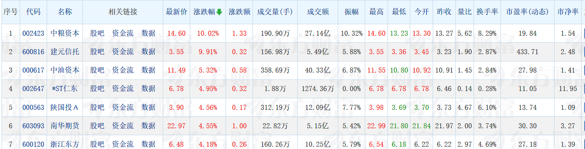

# AKshare

### 文档网址：[https://akshare.akfamily.xyz/](https://akshare.akfamily.xyz/)
```plain
│ │ 股票系统功能完善计划                                                                                                                                                                                        │ │
│ │                                                                                                                                                                                                             │ │
│ │ 阶段一：架构优化 (1-2周)                                                                                                                                                                                    │ │
│ │                                                                                                                                                                                                             │ │
│ │ 1. 代码重构：清理重复文件，统一配置管理                                                                                                                                                                     │ │
│ │ 2. 模块化：重构为可维护的模块结构                                                                                                                                                                           │ │
│ │ 3. 错误处理：完善日志和异常处理机制                                                                                                                                                                         │ │
│ │                                                                                                                                                                                                             │ │
│ │ 阶段二：核心功能增强 (2-3周)                                                                                                                                                                                │ │
│ │                                                                                                                                                                                                             │ │
│ │ 1. 用户系统：实现注册、登录、权限管理                                                                                                                                                                       │ │
│ │ 2. 实时推送：WebSocket实时数据更新                                                                                                                                                                          │ │
│ │ 3. 数据筛选：高级股票筛选器                                                                                                                                                                                 │ │
│ │ 4. 预警系统：价格和指标预警功能                                                                                                                                                                             │ │
│ │                                                                                                                                                                                                             │ │
│ │ 阶段三：分析功能扩展 (2-3周)                                                                                                                                                                                │ │
│ │                                                                                                                                                                                                             │ │
│ │ 1. 投资组合：个人组合管理和分析                                                                                                                                                                             │ │
│ │ 2. 量化策略：简单的策略回测系统                                                                                                                                                                             │ │
│ │ 3. 移动优化：响应式界面和PWA支持                                                                                                                                                                            │ │
│ │ 4. 数据源扩展：接入更多数据提供商                                                                                                                                                                           │ │
│ │                                                                                                                                                                                                             │ │
│ │ 阶段四：智能化升级 (3-4周)                                                                                                                                                                                  │ │
│ │                                                                                                                                                                                                             │ │
│ │ 1. 机器学习：价格预测模型                                                                                                                                                                                   │ │
│ │ 2. 新闻分析：自动化新闻情绪分析                                                                                                                                                                             │ │
│ │ 3. 智能推荐：个性化股票推荐                                                                                                                                                                                 │ │
│ │ 4. 运维监控：系统健康监控                                                                                                                                                                                   │ │
│ │
```

### <font style="background-color:#FFFFFF;">深蓝色专业风格</font>



```sql
"使用Python创建一个独立服务，通过akshare免费接口实时采集数据，并将数据按照Supabase数据库中的表结构存储。具体要求：1) 设计Python脚本自动连接Supabase数据库；2) 根据Supabase现有表格字段结构匹配akshare接口返回的数据格式；3) 实现定时或实时数据采集功能；4) 确保数据完整存储到对应Supabase表中。请包含错误处理和日志记录功能，并优化网络请求性能
```

```sql
"使用Python创建一个独立服务，通过akshare免费接口实时采集数据，并将数据按照PostgreSQL数据库中的表结构存储。具体要求：1) 设计Python脚本自动连接PostgreSQL数据库 2) 根据数据库现有表结构动态映射数据字段 3) 实现akshare接口数据的定时采集功能 4) 确保数据完整存入对应PostgreSQL表 5) 包含错误处理和日志记录功能。优先考虑性能优化和稳定运行。"
```

```sql
1. 新建项目框架
新建一个网站前端项目，基于nodejs20+Vue3+vite+TypeScript
- 直接使用 Vite 模板，完全跳过交互，可以直接使用 Vite 的 Vue+TS 模板: npm init vite-init@latest -y . "--" --template vue-ts
- 在该项目下的package.json中添加必要依赖，注意不要添加其他非必要依赖，一次性安装
- 要注意Vue Router 4中RouteRecordRaw的导入方式
- 在这一步里，请不要写与基础框架无关的页面，比如除了首页、404之外的其他页面。
- 检测是否安装node.js，如果未安装则安装，若已安装则无需再次安装
- 创建一个简洁的 README.md 文件，包含项目介绍和启动方法
- 确保代码是响应式的，不需要兼容移动端，所有页面默认是pc端页面
- 项目运行默认端口8000
- 页面三端适配，包括PC端，手机端，pad端

2. 添加依赖
进入项目，在该项目下的package.json中添加以下依赖：
Element Plus、Vue Router、axios、echarts、mitt、vuex、vuex-along
   - 注意组件版本兼容性
   - 在这一步里，不要添加任何与基础框架无关的页面。

3. 创建布局
创建布局，需要包含以下组件：
Layout主组件，作为路由的父级容器，主组件内嵌套header组件、内容区router-view、footer组件
调整项目整体样式，整体宽度100%，header组件高度为60px，layout的内容区域根据设备自适应宽度（PC端1280px，移动端375px）
header内容区要添加导航栏，导航栏的宽度要略大于内容区宽度，让页面布局更加协调，导航项：可以通过接口合理自己定义，设置活跃项的底部蓝色指示线
导航栏右侧添加搜索框并添加搜索按钮，新增"发布"和"登录"按钮，优化布局和间距
header组件、内容区、footer组件优化布局和间距
   - 用一个默认正方形图片作为logo，默认图片从这个网站引用https://picsum.photos/
   - 在这一步里，不要添加任何与基础框架无关的页面。

   常见问题：运行项目后，如果首页内容不能完全展示，用以下提示词处理css冲突问题
移除vite项目下默认样式中的以下内容，解决css冲突问题：
1. 移除body元素上的display: flex和place-items: center属性
2. 移除#app元素上的text-align: center和padding属性
3. 确保全局样式不会干扰布局组件的正常显示
4. 提供一个干净的CSS基础，避免默认样式与自定义布局冲突
```

```sql
"严格按照提供的截图一比一还原样式和颜色，包括所有视觉元素的精确尺寸、间距、字体、颜色值（使用HEX或RGB格式）以及整体布局结构。确保在不同设备上保持一致的显示效果，并标注需要动态适配的部分。""严格按照提供的截图一比一还原样式和颜色，包括所有视觉元素的精确尺寸、间距、字体、颜色值（使用HEX或RGB格式）以及整体布局结构。确保在不同设备上保持一致的显示效果，并标注需要动态适配的部分。"
```

```sql
 轻量版（最少改动）                                                                                              
      - 拉取后写入 Redis（hash/streams）作“最新快照”；API/WS 从 Redis 回读；每 N 分钟批量持久化 PostgreSQL（COPY/批 
  量 upsert）。                                                                                                     
      - 优点：低延迟、减少 DB 压力；缺点：持久化稍滞后。                                                            
  - 推荐版（PostgreSQL + TimescaleDB）                                                                              
      - 仍用 PostgreSQL，但启用 Timescale 扩展，实时数据入“超表”+连续聚合，冷热分层、压缩与保留策略齐全。           
      - 优点：保留你现有栈，查询时序数据高效，可直接做 1m/5m/日线聚合。                                             
  - 重载版（Kafka/ClickHouse）                                                                                      
      - Ingester→Kafka→ClickHouse（明细）/Postgres（元数据），适合超高频/海量场景。                                 
      - 优点：可线性扩展；缺点：引入新组件、运维复杂。      
```

```sql
"根据AKShare官方文档（参考链接：https://akshare.akfamily.xyz/_sources/installation.md.txt），请帮我优化数据获取失败的问题。具体要求：1) 检查并修复API请求参数设置；2) 确保网络连接和代理配置正确；3) 验证AKShare版本是否最新；4) 提供错误处理的代码示例。重点解决无法获取数据的问题，同时保持代码简洁高效。"

```

### 克隆 akshare
```plain
https://github.com/skyconnfig/akshare.git
```

| **<font style="color:#0a0a0a;">名称</font>** | **<font style="color:#0a0a0a;">描述</font>** |
| --- | --- |
| <font style="color:#0a0a0a;">ts_code</font> | <font style="color:#0a0a0a;">股票代码</font> |
| <font style="color:#0a0a0a;">trade_date</font> | <font style="color:#0a0a0a;">交易日期</font> |
| <font style="color:#0a0a0a;">open</font> | <font style="color:#0a0a0a;">开盘价</font> |
| <font style="color:#0a0a0a;">open_hfq</font> | <font style="color:#0a0a0a;">开盘价（后复权）</font> |
| <font style="color:#0a0a0a;">open_qfq</font> | <font style="color:#0a0a0a;">开盘价（前复权）</font> |
| <font style="color:#0a0a0a;">high</font> | <font style="color:#0a0a0a;">最高价</font> |
| <font style="color:#0a0a0a;">high_hfq</font> | <font style="color:#0a0a0a;">最高价（后复权）</font> |
| <font style="color:#0a0a0a;">high_qfq</font> | <font style="color:#0a0a0a;">最高价（前复权）</font> |
| <font style="color:#0a0a0a;">low</font> | <font style="color:#0a0a0a;">最低价</font> |
| <font style="color:#0a0a0a;">low_hfq</font> | <font style="color:#0a0a0a;">最低价（后复权）</font> |
| <font style="color:#0a0a0a;">low_qfq</font> | <font style="color:#0a0a0a;">最低价（前复权）</font> |
| <font style="color:#0a0a0a;">close</font> | <font style="color:#0a0a0a;">收盘价</font> |
| <font style="color:#0a0a0a;">close_hfq</font> | <font style="color:#0a0a0a;">收盘价（后复权）</font> |
| <font style="color:#0a0a0a;">close_qfq</font> | <font style="color:#0a0a0a;">收盘价（前复权）</font> |
| <font style="color:#0a0a0a;">pre_close</font> | <font style="color:#0a0a0a;">昨收价(前复权)</font> |
| <font style="color:#0a0a0a;">change</font> | <font style="color:#0a0a0a;">涨跌额</font> |
| <font style="color:#0a0a0a;">pct_chg</font> | <font style="color:#0a0a0a;">涨跌幅</font><font style="color:#0a0a0a;"> </font><font style="color:#0a0a0a;">（未复权）</font> |
| <font style="color:#0a0a0a;">vol</font> | <font style="color:#0a0a0a;">成交量 （手）</font> |
| <font style="color:#0a0a0a;">amount</font> | <font style="color:#0a0a0a;">成交额 （千元）</font> |
| <font style="color:#0a0a0a;">turnover_rate</font> | <font style="color:#0a0a0a;">换手率（%）</font> |
| <font style="color:#0a0a0a;">turnover_rate_f</font> | <font style="color:#0a0a0a;">换手率（自由流通股）</font> |
| <font style="color:#0a0a0a;">volume_ratio</font> | <font style="color:#0a0a0a;">量比</font> |
| <font style="color:#0a0a0a;">pe</font> | <font style="color:#0a0a0a;">市盈率（总市值/净利润， 亏损的PE为空）</font> |
| <font style="color:#0a0a0a;">pe_ttm</font> | <font style="color:#0a0a0a;">市盈率（</font><font style="color:#0a0a0a;">TTM</font><font style="color:#0a0a0a;">，亏损的</font><font style="color:#0a0a0a;">PE</font><font style="color:#0a0a0a;">为空）</font> |
| <font style="color:#0a0a0a;">pb</font> | <font style="color:#0a0a0a;">市净率（总市值/净资产）</font> |
| <font style="color:#0a0a0a;">ps</font> | <font style="color:#0a0a0a;">市销率</font> |
| <font style="color:#0a0a0a;">ps_ttm</font> | <font style="color:#0a0a0a;">市销率（TTM）</font> |
| <font style="color:#0a0a0a;">dv_ratio</font> | <font style="color:#0a0a0a;">股息率 （%）</font> |
| <font style="color:#0a0a0a;">dv_ttm</font> | <font style="color:#0a0a0a;">股息率（TTM）（%）</font> |
| <font style="color:#0a0a0a;">total_share</font> | <font style="color:#0a0a0a;">总股本 （万股）</font> |
| <font style="color:#0a0a0a;">float_share</font> | <font style="color:#0a0a0a;">流通股本 （万股）</font> |
| <font style="color:#0a0a0a;">free_share</font> | <font style="color:#0a0a0a;">自由流通股本 （万）</font> |
| <font style="color:#0a0a0a;">total_mv</font> | <font style="color:#0a0a0a;">总市值 （万元）</font> |
| <font style="color:#0a0a0a;">circ_mv</font> | <font style="color:#0a0a0a;">流通市值（万元）</font> |
| <font style="color:#0a0a0a;">adj_factor</font> | <font style="color:#0a0a0a;">复权因子</font> |
| <font style="color:#0a0a0a;">asi_bfq</font> | <font style="color:#0a0a0a;">振动升降指标-OPEN, CLOSE, HIGH, LOW, M1=26, M2=10</font> |
| <font style="color:#0a0a0a;">asi_hfq</font> | <font style="color:#0a0a0a;">振动升降指标-OPEN, CLOSE, HIGH, LOW, M1=26, M2=10</font> |
| <font style="color:#0a0a0a;">asi_qfq</font> | <font style="color:#0a0a0a;">振动升降指标-OPEN, CLOSE, HIGH, LOW, M1=26, M2=10</font> |
| <font style="color:#0a0a0a;">asit_bfq</font> | <font style="color:#0a0a0a;">振动升降指标-OPEN, CLOSE, HIGH, LOW, M1=26, M2=10</font> |
| <font style="color:#0a0a0a;">asit_hfq</font> | <font style="color:#0a0a0a;">振动升降指标-OPEN, CLOSE, HIGH, LOW, M1=26, M2=10</font> |
| <font style="color:#0a0a0a;">asit_qfq</font> | <font style="color:#0a0a0a;">振动升降指标-OPEN, CLOSE, HIGH, LOW, M1=26, M2=10</font> |
| <font style="color:#0a0a0a;">atr_bfq</font> | <font style="color:#0a0a0a;">真实波动N日平均值-CLOSE, HIGH, LOW, N=20</font> |
| <font style="color:#0a0a0a;">atr_hfq</font> | <font style="color:#0a0a0a;">真实波动N日平均值-CLOSE, HIGH, LOW, N=20</font> |
| <font style="color:#0a0a0a;">atr_qfq</font> | <font style="color:#0a0a0a;">真实波动N日平均值-CLOSE, HIGH, LOW, N=20</font> |
| <font style="color:#0a0a0a;">bbi_bfq</font> | <font style="color:#0a0a0a;">BBI多空指标-CLOSE, M1=3, M2=6, M3=12, M4=20</font> |
| <font style="color:#0a0a0a;">bbi_hfq</font> | <font style="color:#0a0a0a;">BBI多空指标-CLOSE, M1=3, M2=6, M3=12, M4=21</font> |
| <font style="color:#0a0a0a;">bbi_qfq</font> | <font style="color:#0a0a0a;">BBI多空指标-CLOSE, M1=3, M2=6, M3=12, M4=22</font> |
| <font style="color:#0a0a0a;">bias1_bfq</font> | <font style="color:#0a0a0a;">BIAS乖离率-CLOSE, L1=6, L2=12, L3=24</font> |
| <font style="color:#0a0a0a;">bias1_hfq</font> | <font style="color:#0a0a0a;">BIAS乖离率-CLOSE, L1=6, L2=12, L3=24</font> |
| <font style="color:#0a0a0a;">bias1_qfq</font> | <font style="color:#0a0a0a;">BIAS乖离率-CLOSE, L1=6, L2=12, L3=24</font> |
| <font style="color:#0a0a0a;">bias2_bfq</font> | <font style="color:#0a0a0a;">BIAS乖离率-CLOSE, L1=6, L2=12, L3=24</font> |
| <font style="color:#0a0a0a;">bias2_hfq</font> | <font style="color:#0a0a0a;">BIAS乖离率-CLOSE, L1=6, L2=12, L3=24</font> |
| <font style="color:#0a0a0a;">bias2_qfq</font> | <font style="color:#0a0a0a;">BIAS乖离率-CLOSE, L1=6, L2=12, L3=24</font> |
| <font style="color:#0a0a0a;">bias3_bfq</font> | <font style="color:#0a0a0a;">BIAS乖离率-CLOSE, L1=6, L2=12, L3=24</font> |
| <font style="color:#0a0a0a;">bias3_hfq</font> | <font style="color:#0a0a0a;">BIAS乖离率-CLOSE, L1=6, L2=12, L3=24</font> |
| <font style="color:#0a0a0a;">bias3_qfq</font> | <font style="color:#0a0a0a;">BIAS乖离率-CLOSE, L1=6, L2=12, L3=24</font> |
| <font style="color:#0a0a0a;">boll_lower_bfq</font> | <font style="color:#0a0a0a;">BOLL指标，布林带-CLOSE, N=20, P=2</font> |
| <font style="color:#0a0a0a;">boll_lower_hfq</font> | <font style="color:#0a0a0a;">BOLL指标，布林带-CLOSE, N=20, P=2</font> |
| <font style="color:#0a0a0a;">boll_lower_qfq</font> | <font style="color:#0a0a0a;">BOLL指标，布林带-CLOSE, N=20, P=2</font> |
| <font style="color:#0a0a0a;">boll_mid_bfq</font> | <font style="color:#0a0a0a;">BOLL指标，布林带-CLOSE, N=20, P=2</font> |
| <font style="color:#0a0a0a;">boll_mid_hfq</font> | <font style="color:#0a0a0a;">BOLL指标，布林带-CLOSE, N=20, P=2</font> |
| <font style="color:#0a0a0a;">boll_mid_qfq</font> | <font style="color:#0a0a0a;">BOLL指标，布林带-CLOSE, N=20, P=2</font> |
| <font style="color:#0a0a0a;">boll_upper_bfq</font> | <font style="color:#0a0a0a;">BOLL指标，布林带-CLOSE, N=20, P=2</font> |
| <font style="color:#0a0a0a;">boll_upper_hfq</font> | <font style="color:#0a0a0a;">BOLL指标，布林带-CLOSE, N=20, P=2</font> |
| <font style="color:#0a0a0a;">boll_upper_qfq</font> | <font style="color:#0a0a0a;">BOLL指标，布林带-CLOSE, N=20, P=2</font> |
| <font style="color:#0a0a0a;">brar_ar_bfq</font> | <font style="color:#0a0a0a;">BRAR情绪指标-OPEN, CLOSE, HIGH, LOW, M1=26</font> |
| <font style="color:#0a0a0a;">brar_ar_hfq</font> | <font style="color:#0a0a0a;">BRAR情绪指标-OPEN, CLOSE, HIGH, LOW, M1=26</font> |
| <font style="color:#0a0a0a;">brar_ar_qfq</font> | <font style="color:#0a0a0a;">BRAR情绪指标-OPEN, CLOSE, HIGH, LOW, M1=26</font> |
| <font style="color:#0a0a0a;">brar_br_bfq</font> | <font style="color:#0a0a0a;">BRAR情绪指标-OPEN, CLOSE, HIGH, LOW, M1=26</font> |
| <font style="color:#0a0a0a;">brar_br_hfq</font> | <font style="color:#0a0a0a;">BRAR情绪指标-OPEN, CLOSE, HIGH, LOW, M1=26</font> |
| <font style="color:#0a0a0a;">brar_br_qfq</font> | <font style="color:#0a0a0a;">BRAR情绪指标-OPEN, CLOSE, HIGH, LOW, M1=26</font> |
| <font style="color:#0a0a0a;">cci_bfq</font> | <font style="color:#0a0a0a;">顺势指标又叫CCI指标-CLOSE, HIGH, LOW, N=14</font> |
| <font style="color:#0a0a0a;">cci_hfq</font> | <font style="color:#0a0a0a;">顺势指标又叫CCI指标-CLOSE, HIGH, LOW, N=14</font> |
| <font style="color:#0a0a0a;">cci_qfq</font> | <font style="color:#0a0a0a;">顺势指标又叫CCI指标-CLOSE, HIGH, LOW, N=14</font> |
| <font style="color:#0a0a0a;">cr_bfq</font> | <font style="color:#0a0a0a;">CR价格动量指标-CLOSE, HIGH, LOW, N=20</font> |
| <font style="color:#0a0a0a;">cr_hfq</font> | <font style="color:#0a0a0a;">CR价格动量指标-CLOSE, HIGH, LOW, N=20</font> |
| <font style="color:#0a0a0a;">cr_qfq</font> | <font style="color:#0a0a0a;">CR价格动量指标-CLOSE, HIGH, LOW, N=20</font> |
| <font style="color:#0a0a0a;">dfma_dif_bfq</font> | <font style="color:#0a0a0a;">平行线差指标-CLOSE, N1=10, N2=50, M=10</font> |
| <font style="color:#0a0a0a;">dfma_dif_hfq</font> | <font style="color:#0a0a0a;">平行线差指标-CLOSE, N1=10, N2=50, M=10</font> |
| <font style="color:#0a0a0a;">dfma_dif_qfq</font> | <font style="color:#0a0a0a;">平行线差指标-CLOSE, N1=10, N2=50, M=10</font> |
| <font style="color:#0a0a0a;">dfma_difma_bfq</font> | <font style="color:#0a0a0a;">平行线差指标-CLOSE, N1=10, N2=50, M=10</font> |
| <font style="color:#0a0a0a;">dfma_difma_hfq</font> | <font style="color:#0a0a0a;">平行线差指标-CLOSE, N1=10, N2=50, M=10</font> |
| <font style="color:#0a0a0a;">dfma_difma_qfq</font> | <font style="color:#0a0a0a;">平行线差指标-CLOSE, N1=10, N2=50, M=10</font> |
| <font style="color:#0a0a0a;">dmi_adx_bfq</font> | <font style="color:#0a0a0a;">动向指标-CLOSE, HIGH, LOW, M1=14, M2=6</font> |
| <font style="color:#0a0a0a;">dmi_adx_hfq</font> | <font style="color:#0a0a0a;">动向指标-CLOSE, HIGH, LOW, M1=14, M2=6</font> |
| <font style="color:#0a0a0a;">dmi_adx_qfq</font> | <font style="color:#0a0a0a;">动向指标-CLOSE, HIGH, LOW, M1=14, M2=6</font> |
| <font style="color:#0a0a0a;">dmi_adxr_bfq</font> | <font style="color:#0a0a0a;">动向指标-CLOSE, HIGH, LOW, M1=14, M2=6</font> |
| <font style="color:#0a0a0a;">dmi_adxr_hfq</font> | <font style="color:#0a0a0a;">动向指标-CLOSE, HIGH, LOW, M1=14, M2=6</font> |
| <font style="color:#0a0a0a;">dmi_adxr_qfq</font> | <font style="color:#0a0a0a;">动向指标-CLOSE, HIGH, LOW, M1=14, M2=6</font> |
| <font style="color:#0a0a0a;">dmi_mdi_bfq</font> | <font style="color:#0a0a0a;">动向指标-CLOSE, HIGH, LOW, M1=14, M2=6</font> |
| <font style="color:#0a0a0a;">dmi_mdi_hfq</font> | <font style="color:#0a0a0a;">动向指标-CLOSE, HIGH, LOW, M1=14, M2=6</font> |
| <font style="color:#0a0a0a;">dmi_mdi_qfq</font> | <font style="color:#0a0a0a;">动向指标-CLOSE, HIGH, LOW, M1=14, M2=6</font> |
| <font style="color:#0a0a0a;">dmi_pdi_bfq</font> | <font style="color:#0a0a0a;">动向指标-CLOSE, HIGH, LOW, M1=14, M2=6</font> |
| <font style="color:#0a0a0a;">dmi_pdi_hfq</font> | <font style="color:#0a0a0a;">动向指标-CLOSE, HIGH, LOW, M1=14, M2=6</font> |
| <font style="color:#0a0a0a;">dmi_pdi_qfq</font> | <font style="color:#0a0a0a;">动向指标-CLOSE, HIGH, LOW, M1=14, M2=6</font> |
| <font style="color:#0a0a0a;">downdays</font> | <font style="color:#0a0a0a;">连跌天数</font> |
| <font style="color:#0a0a0a;">updays</font> | <font style="color:#0a0a0a;">连涨天数</font> |
| <font style="color:#0a0a0a;">dpo_bfq</font> | <font style="color:#0a0a0a;">区间震荡线-CLOSE, M1=20, M2=10, M3=6</font> |
| <font style="color:#0a0a0a;">dpo_hfq</font> | <font style="color:#0a0a0a;">区间震荡线-CLOSE, M1=20, M2=10, M3=6</font> |
| <font style="color:#0a0a0a;">dpo_qfq</font> | <font style="color:#0a0a0a;">区间震荡线-CLOSE, M1=20, M2=10, M3=6</font> |
| <font style="color:#0a0a0a;">madpo_bfq</font> | <font style="color:#0a0a0a;">区间震荡线-CLOSE, M1=20, M2=10, M3=6</font> |
| <font style="color:#0a0a0a;">madpo_hfq</font> | <font style="color:#0a0a0a;">区间震荡线-CLOSE, M1=20, M2=10, M3=6</font> |
| <font style="color:#0a0a0a;">madpo_qfq</font> | <font style="color:#0a0a0a;">区间震荡线-CLOSE, M1=20, M2=10, M3=6</font> |
| <font style="color:#0a0a0a;">ema_bfq_10</font> | <font style="color:#0a0a0a;">指数移动平均-N=10</font> |
| <font style="color:#0a0a0a;">ema_bfq_20</font> | <font style="color:#0a0a0a;">指数移动平均-N=20</font> |
| <font style="color:#0a0a0a;">ema_bfq_250</font> | <font style="color:#0a0a0a;">指数移动平均-N=250</font> |
| <font style="color:#0a0a0a;">ema_bfq_30</font> | <font style="color:#0a0a0a;">指数移动平均-N=30</font> |
| <font style="color:#0a0a0a;">ema_bfq_5</font> | <font style="color:#0a0a0a;">指数移动平均-N=5</font> |
| <font style="color:#0a0a0a;">ema_bfq_60</font> | <font style="color:#0a0a0a;">指数移动平均-N=60</font> |
| <font style="color:#0a0a0a;">ema_bfq_90</font> | <font style="color:#0a0a0a;">指数移动平均-N=90</font> |
| <font style="color:#0a0a0a;">ema_hfq_10</font> | <font style="color:#0a0a0a;">指数移动平均-N=10</font> |
| <font style="color:#0a0a0a;">ema_hfq_20</font> | <font style="color:#0a0a0a;">指数移动平均-N=20</font> |
| <font style="color:#0a0a0a;">ema_hfq_250</font> | <font style="color:#0a0a0a;">指数移动平均-N=250</font> |
| <font style="color:#0a0a0a;">ema_hfq_30</font> | <font style="color:#0a0a0a;">指数移动平均-N=30</font> |
| <font style="color:#0a0a0a;">ema_hfq_5</font> | <font style="color:#0a0a0a;">指数移动平均-N=5</font> |
| <font style="color:#0a0a0a;">ema_hfq_60</font> | <font style="color:#0a0a0a;">指数移动平均-N=60</font> |
| <font style="color:#0a0a0a;">ema_hfq_90</font> | <font style="color:#0a0a0a;">指数移动平均-N=90</font> |
| <font style="color:#0a0a0a;">ema_qfq_10</font> | <font style="color:#0a0a0a;">指数移动平均-N=10</font> |
| <font style="color:#0a0a0a;">ema_qfq_20</font> | <font style="color:#0a0a0a;">指数移动平均-N=20</font> |
| <font style="color:#0a0a0a;">ema_qfq_250</font> | <font style="color:#0a0a0a;">指数移动平均-N=250</font> |
| <font style="color:#0a0a0a;">ema_qfq_30</font> | <font style="color:#0a0a0a;">指数移动平均-N=30</font> |
| <font style="color:#0a0a0a;">ema_qfq_5</font> | <font style="color:#0a0a0a;">指数移动平均-N=5</font> |
| <font style="color:#0a0a0a;">ema_qfq_60</font> | <font style="color:#0a0a0a;">指数移动平均-N=60</font> |
| <font style="color:#0a0a0a;">ema_qfq_90</font> | <font style="color:#0a0a0a;">指数移动平均-N=90</font> |
| <font style="color:#0a0a0a;">emv_bfq</font> | <font style="color:#0a0a0a;">简易波动指标-HIGH, LOW, VOL, N=14, M=9</font> |
| <font style="color:#0a0a0a;">emv_hfq</font> | <font style="color:#0a0a0a;">简易波动指标-HIGH, LOW, VOL, N=14, M=9</font> |
| <font style="color:#0a0a0a;">emv_qfq</font> | <font style="color:#0a0a0a;">简易波动指标-HIGH, LOW, VOL, N=14, M=9</font> |
| <font style="color:#0a0a0a;">maemv_bfq</font> | <font style="color:#0a0a0a;">简易波动指标-HIGH, LOW, VOL, N=14, M=9</font> |
| <font style="color:#0a0a0a;">maemv_hfq</font> | <font style="color:#0a0a0a;">简易波动指标-HIGH, LOW, VOL, N=14, M=9</font> |
| <font style="color:#0a0a0a;">maemv_qfq</font> | <font style="color:#0a0a0a;">简易波动指标-HIGH, LOW, VOL, N=14, M=9</font> |
| <font style="color:#0a0a0a;">expma_12_bfq</font> | <font style="color:#0a0a0a;">EMA指数平均数指标-CLOSE, N1=12, N2=50</font> |
| <font style="color:#0a0a0a;">expma_12_hfq</font> | <font style="color:#0a0a0a;">EMA指数平均数指标-CLOSE, N1=12, N2=50</font> |
| <font style="color:#0a0a0a;">expma_12_qfq</font> | <font style="color:#0a0a0a;">EMA指数平均数指标-CLOSE, N1=12, N2=50</font> |
| <font style="color:#0a0a0a;">expma_50_bfq</font> | <font style="color:#0a0a0a;">EMA指数平均数指标-CLOSE, N1=12, N2=50</font> |
| <font style="color:#0a0a0a;">expma_50_hfq</font> | <font style="color:#0a0a0a;">EMA指数平均数指标-CLOSE, N1=12, N2=50</font> |
| <font style="color:#0a0a0a;">expma_50_qfq</font> | <font style="color:#0a0a0a;">EMA指数平均数指标-CLOSE, N1=12, N2=50</font> |
| <font style="color:#0a0a0a;">kdj_bfq</font> | <font style="color:#0a0a0a;">KDJ指标-CLOSE, HIGH, LOW, N=9, M1=3, M2=3</font> |
| <font style="color:#0a0a0a;">kdj_hfq</font> | <font style="color:#0a0a0a;">KDJ指标-CLOSE, HIGH, LOW, N=9, M1=3, M2=3</font> |
| <font style="color:#0a0a0a;">kdj_qfq</font> | <font style="color:#0a0a0a;">KDJ指标-CLOSE, HIGH, LOW, N=9, M1=3, M2=3</font> |
| <font style="color:#0a0a0a;">kdj_d_bfq</font> | <font style="color:#0a0a0a;">KDJ指标-CLOSE, HIGH, LOW, N=9, M1=3, M2=3</font> |
| <font style="color:#0a0a0a;">kdj_d_hfq</font> | <font style="color:#0a0a0a;">KDJ指标-CLOSE, HIGH, LOW, N=9, M1=3, M2=3</font> |
| <font style="color:#0a0a0a;">kdj_d_qfq</font> | <font style="color:#0a0a0a;">KDJ指标-CLOSE, HIGH, LOW, N=9, M1=3, M2=3</font> |
| <font style="color:#0a0a0a;">kdj_k_bfq</font> | <font style="color:#0a0a0a;">KDJ指标-CLOSE, HIGH, LOW, N=9, M1=3, M2=3</font> |
| <font style="color:#0a0a0a;">kdj_k_hfq</font> | <font style="color:#0a0a0a;">KDJ指标-CLOSE, HIGH, LOW, N=9, M1=3, M2=3</font> |
| <font style="color:#0a0a0a;">kdj_k_qfq</font> | <font style="color:#0a0a0a;">KDJ指标-CLOSE, HIGH, LOW, N=9, M1=3, M2=3</font> |
| <font style="color:#0a0a0a;">ktn_down_bfq</font> | <font style="color:#0a0a0a;">肯特纳交易通道, N选20日，ATR选10日-CLOSE, HIGH, LOW, N=20, M=10</font> |
| <font style="color:#0a0a0a;">ktn_down_hfq</font> | <font style="color:#0a0a0a;">肯特纳交易通道, N选20日，ATR选10日-CLOSE, HIGH, LOW, N=20, M=10</font> |
| <font style="color:#0a0a0a;">ktn_down_qfq</font> | <font style="color:#0a0a0a;">肯特纳交易通道, N选20日，ATR选10日-CLOSE, HIGH, LOW, N=20, M=10</font> |
| <font style="color:#0a0a0a;">ktn_mid_bfq</font> | <font style="color:#0a0a0a;">肯特纳交易通道, N选20日，ATR选10日-CLOSE, HIGH, LOW, N=20, M=10</font> |
| <font style="color:#0a0a0a;">ktn_mid_hfq</font> | <font style="color:#0a0a0a;">肯特纳交易通道, N选20日，ATR选10日-CLOSE, HIGH, LOW, N=20, M=10</font> |
| <font style="color:#0a0a0a;">ktn_mid_qfq</font> | <font style="color:#0a0a0a;">肯特纳交易通道, N选20日，ATR选10日-CLOSE, HIGH, LOW, N=20, M=10</font> |
| <font style="color:#0a0a0a;">ktn_upper_bfq</font> | <font style="color:#0a0a0a;">肯特纳交易通道, N选20日，ATR选10日-CLOSE, HIGH, LOW, N=20, M=10</font> |
| <font style="color:#0a0a0a;">ktn_upper_hfq</font> | <font style="color:#0a0a0a;">肯特纳交易通道, N选20日，ATR选10日-CLOSE, HIGH, LOW, N=20, M=10</font> |
| <font style="color:#0a0a0a;">ktn_upper_qfq</font> | <font style="color:#0a0a0a;">肯特纳交易通道, N选20日，ATR选10日-CLOSE, HIGH, LOW, N=20, M=10</font> |
| <font style="color:#0a0a0a;">lowdays</font> | <font style="color:#0a0a0a;">LOWRANGE(LOW)表示当前最低价是近多少周期内最低价的最小值</font> |
| <font style="color:#0a0a0a;">topdays</font> | <font style="color:#0a0a0a;">TOPRANGE(HIGH)表示当前最高价是近多少周期内最高价的最大值</font> |
| <font style="color:#0a0a0a;">ma_bfq_10</font> | <font style="color:#0a0a0a;">简单移动平均-N=10</font> |
| <font style="color:#0a0a0a;">ma_bfq_20</font> | <font style="color:#0a0a0a;">简单移动平均-N=20</font> |
| <font style="color:#0a0a0a;">ma_bfq_250</font> | <font style="color:#0a0a0a;">简单移动平均-N=250</font> |
| <font style="color:#0a0a0a;">ma_bfq_30</font> | <font style="color:#0a0a0a;">简单移动平均-N=30</font> |
| <font style="color:#0a0a0a;">ma_bfq_5</font> | <font style="color:#0a0a0a;">简单移动平均-N=5</font> |
| <font style="color:#0a0a0a;">ma_bfq_60</font> | <font style="color:#0a0a0a;">简单移动平均-N=60</font> |
| <font style="color:#0a0a0a;">ma_bfq_90</font> | <font style="color:#0a0a0a;">简单移动平均-N=90</font> |
| <font style="color:#0a0a0a;">ma_hfq_10</font> | <font style="color:#0a0a0a;">简单移动平均-N=10</font> |
| <font style="color:#0a0a0a;">ma_hfq_20</font> | <font style="color:#0a0a0a;">简单移动平均-N=20</font> |
| <font style="color:#0a0a0a;">ma_hfq_250</font> | <font style="color:#0a0a0a;">简单移动平均-N=250</font> |
| <font style="color:#0a0a0a;">ma_hfq_30</font> | <font style="color:#0a0a0a;">简单移动平均-N=30</font> |
| <font style="color:#0a0a0a;">ma_hfq_5</font> | <font style="color:#0a0a0a;">简单移动平均-N=5</font> |
| <font style="color:#0a0a0a;">ma_hfq_60</font> | <font style="color:#0a0a0a;">简单移动平均-N=60</font> |
| <font style="color:#0a0a0a;">ma_hfq_90</font> | <font style="color:#0a0a0a;">简单移动平均-N=90</font> |
| <font style="color:#0a0a0a;">ma_qfq_10</font> | <font style="color:#0a0a0a;">简单移动平均-N=10</font> |
| <font style="color:#0a0a0a;">ma_qfq_20</font> | <font style="color:#0a0a0a;">简单移动平均-N=20</font> |
| <font style="color:#0a0a0a;">ma_qfq_250</font> | <font style="color:#0a0a0a;">简单移动平均-N=250</font> |
| <font style="color:#0a0a0a;">ma_qfq_30</font> | <font style="color:#0a0a0a;">简单移动平均-N=30</font> |
| <font style="color:#0a0a0a;">ma_qfq_5</font> | <font style="color:#0a0a0a;">简单移动平均-N=5</font> |
| <font style="color:#0a0a0a;">ma_qfq_60</font> | <font style="color:#0a0a0a;">简单移动平均-N=60</font> |
| <font style="color:#0a0a0a;">ma_qfq_90</font> | <font style="color:#0a0a0a;">简单移动平均-N=90</font> |
| <font style="color:#0a0a0a;">macd_bfq</font> | <font style="color:#0a0a0a;">MACD指标-CLOSE, SHORT=12, LONG=26, M=9</font> |
| <font style="color:#0a0a0a;">macd_hfq</font> | <font style="color:#0a0a0a;">MACD指标-CLOSE, SHORT=12, LONG=26, M=9</font> |
| <font style="color:#0a0a0a;">macd_qfq</font> | <font style="color:#0a0a0a;">MACD指标-CLOSE, SHORT=12, LONG=26, M=9</font> |
| <font style="color:#0a0a0a;">macd_dea_bfq</font> | <font style="color:#0a0a0a;">MACD指标-CLOSE, SHORT=12, LONG=26, M=9</font> |
| <font style="color:#0a0a0a;">macd_dea_hfq</font> | <font style="color:#0a0a0a;">MACD指标-CLOSE, SHORT=12, LONG=26, M=9</font> |
| <font style="color:#0a0a0a;">macd_dea_qfq</font> | <font style="color:#0a0a0a;">MACD指标-CLOSE, SHORT=12, LONG=26, M=9</font> |
| <font style="color:#0a0a0a;">macd_dif_bfq</font> | <font style="color:#0a0a0a;">MACD指标-CLOSE, SHORT=12, LONG=26, M=9</font> |
| <font style="color:#0a0a0a;">macd_dif_hfq</font> | <font style="color:#0a0a0a;">MACD指标-CLOSE, SHORT=12, LONG=26, M=9</font> |
| <font style="color:#0a0a0a;">macd_dif_qfq</font> | <font style="color:#0a0a0a;">MACD指标-CLOSE, SHORT=12, LONG=26, M=9</font> |
| <font style="color:#0a0a0a;">mass_bfq</font> | <font style="color:#0a0a0a;">梅斯线-HIGH, LOW, N1=9, N2=25, M=6</font> |
| <font style="color:#0a0a0a;">mass_hfq</font> | <font style="color:#0a0a0a;">梅斯线-HIGH, LOW, N1=9, N2=25, M=6</font> |
| <font style="color:#0a0a0a;">mass_qfq</font> | <font style="color:#0a0a0a;">梅斯线-HIGH, LOW, N1=9, N2=25, M=6</font> |
| <font style="color:#0a0a0a;">ma_mass_bfq</font> | <font style="color:#0a0a0a;">梅斯线-HIGH, LOW, N1=9, N2=25, M=6</font> |
| <font style="color:#0a0a0a;">ma_mass_hfq</font> | <font style="color:#0a0a0a;">梅斯线-HIGH, LOW, N1=9, N2=25, M=6</font> |
| <font style="color:#0a0a0a;">ma_mass_qfq</font> | <font style="color:#0a0a0a;">梅斯线-HIGH, LOW, N1=9, N2=25, M=6</font> |
| <font style="color:#0a0a0a;">mfi_bfq</font> | <font style="color:#0a0a0a;">MFI指标是成交量的RSI指标-CLOSE, HIGH, LOW, VOL, N=14</font> |
| <font style="color:#0a0a0a;">mfi_hfq</font> | <font style="color:#0a0a0a;">MFI指标是成交量的RSI指标-CLOSE, HIGH, LOW, VOL, N=14</font> |
| <font style="color:#0a0a0a;">mfi_qfq</font> | <font style="color:#0a0a0a;">MFI指标是成交量的RSI指标-CLOSE, HIGH, LOW, VOL, N=14</font> |
| <font style="color:#0a0a0a;">mtm_bfq</font> | <font style="color:#0a0a0a;">动量指标-CLOSE, N=12, M=6</font> |
| <font style="color:#0a0a0a;">mtm_hfq</font> | <font style="color:#0a0a0a;">动量指标-CLOSE, N=12, M=6</font> |
| <font style="color:#0a0a0a;">mtm_qfq</font> | <font style="color:#0a0a0a;">动量指标-CLOSE, N=12, M=6</font> |
| <font style="color:#0a0a0a;">mtmma_bfq</font> | <font style="color:#0a0a0a;">动量指标-CLOSE, N=12, M=6</font> |
| <font style="color:#0a0a0a;">mtmma_hfq</font> | <font style="color:#0a0a0a;">动量指标-CLOSE, N=12, M=6</font> |
| <font style="color:#0a0a0a;">mtmma_qfq</font> | <font style="color:#0a0a0a;">动量指标-CLOSE, N=12, M=6</font> |
| <font style="color:#0a0a0a;">obv_bfq</font> | <font style="color:#0a0a0a;">能量潮指标-CLOSE, VOL</font> |
| <font style="color:#0a0a0a;">obv_hfq</font> | <font style="color:#0a0a0a;">能量潮指标-CLOSE, VOL</font> |
| <font style="color:#0a0a0a;">obv_qfq</font> | <font style="color:#0a0a0a;">能量潮指标-CLOSE, VOL</font> |
| <font style="color:#0a0a0a;">psy_bfq</font> | <font style="color:#0a0a0a;">投资者对股市涨跌产生心理波动的情绪指标-CLOSE, N=12, M=6</font> |
| <font style="color:#0a0a0a;">psy_hfq</font> | <font style="color:#0a0a0a;">投资者对股市涨跌产生心理波动的情绪指标-CLOSE, N=12, M=6</font> |
| <font style="color:#0a0a0a;">psy_qfq</font> | <font style="color:#0a0a0a;">投资者对股市涨跌产生心理波动的情绪指标-CLOSE, N=12, M=6</font> |
| <font style="color:#0a0a0a;">psyma_bfq</font> | <font style="color:#0a0a0a;">投资者对股市涨跌产生心理波动的情绪指标-CLOSE, N=12, M=6</font> |
| <font style="color:#0a0a0a;">psyma_hfq</font> | <font style="color:#0a0a0a;">投资者对股市涨跌产生心理波动的情绪指标-CLOSE, N=12, M=6</font> |
| <font style="color:#0a0a0a;">psyma_qfq</font> | <font style="color:#0a0a0a;">投资者对股市涨跌产生心理波动的情绪指标-CLOSE, N=12, M=6</font> |
| <font style="color:#0a0a0a;">roc_bfq</font> | <font style="color:#0a0a0a;">变动率指标-CLOSE, N=12, M=6</font> |
| <font style="color:#0a0a0a;">roc_hfq</font> | <font style="color:#0a0a0a;">变动率指标-CLOSE, N=12, M=6</font> |
| <font style="color:#0a0a0a;">roc_qfq</font> | <font style="color:#0a0a0a;">变动率指标-CLOSE, N=12, M=6</font> |
| <font style="color:#0a0a0a;">maroc_bfq</font> | <font style="color:#0a0a0a;">变动率指标-CLOSE, N=12, M=6</font> |
| <font style="color:#0a0a0a;">maroc_hfq</font> | <font style="color:#0a0a0a;">变动率指标-CLOSE, N=12, M=6</font> |
| <font style="color:#0a0a0a;">maroc_qfq</font> | <font style="color:#0a0a0a;">变动率指标-CLOSE, N=12, M=6</font> |
| <font style="color:#0a0a0a;">rsi_bfq_12</font> | <font style="color:#0a0a0a;">RSI指标-CLOSE, N=12</font> |
| <font style="color:#0a0a0a;">rsi_bfq_24</font> | <font style="color:#0a0a0a;">RSI指标-CLOSE, N=24</font> |
| <font style="color:#0a0a0a;">rsi_bfq_6</font> | <font style="color:#0a0a0a;">RSI指标-CLOSE, N=6</font> |
| <font style="color:#0a0a0a;">rsi_hfq_12</font> | <font style="color:#0a0a0a;">RSI指标-CLOSE, N=12</font> |
| <font style="color:#0a0a0a;">rsi_hfq_24</font> | <font style="color:#0a0a0a;">RSI指标-CLOSE, N=24</font> |
| <font style="color:#0a0a0a;">rsi_hfq_6</font> | <font style="color:#0a0a0a;">RSI指标-CLOSE, N=6</font> |
| <font style="color:#0a0a0a;">rsi_qfq_12</font> | <font style="color:#0a0a0a;">RSI指标-CLOSE, N=12</font> |
| <font style="color:#0a0a0a;">rsi_qfq_24</font> | <font style="color:#0a0a0a;">RSI指标-CLOSE, N=24</font> |
| <font style="color:#0a0a0a;">rsi_qfq_6</font> | <font style="color:#0a0a0a;">RSI指标-CLOSE, N=6</font> |
| <font style="color:#0a0a0a;">taq_down_bfq</font> | <font style="color:#0a0a0a;">唐安奇通道(海龟)交易指标-HIGH, LOW, 20</font> |
| <font style="color:#0a0a0a;">taq_down_hfq</font> | <font style="color:#0a0a0a;">唐安奇通道(海龟)交易指标-HIGH, LOW, 20</font> |
| <font style="color:#0a0a0a;">taq_down_qfq</font> | <font style="color:#0a0a0a;">唐安奇通道(海龟)交易指标-HIGH, LOW, 20</font> |
| <font style="color:#0a0a0a;">taq_mid_bfq</font> | <font style="color:#0a0a0a;">唐安奇通道(海龟)交易指标-HIGH, LOW, 20</font> |
| <font style="color:#0a0a0a;">taq_mid_hfq</font> | <font style="color:#0a0a0a;">唐安奇通道(海龟)交易指标-HIGH, LOW, 20</font> |
| <font style="color:#0a0a0a;">taq_mid_qfq</font> | <font style="color:#0a0a0a;">唐安奇通道(海龟)交易指标-HIGH, LOW, 20</font> |
| <font style="color:#0a0a0a;">taq_up_bfq</font> | <font style="color:#0a0a0a;">唐安奇通道(海龟)交易指标-HIGH, LOW, 20</font> |
| <font style="color:#0a0a0a;">taq_up_hfq</font> | <font style="color:#0a0a0a;">唐安奇通道(海龟)交易指标-HIGH, LOW, 20</font> |
| <font style="color:#0a0a0a;">taq_up_qfq</font> | <font style="color:#0a0a0a;">唐安奇通道(海龟)交易指标-HIGH, LOW, 20</font> |
| <font style="color:#0a0a0a;">trix_bfq</font> | <font style="color:#0a0a0a;">三重指数平滑平均线-CLOSE, M1=12, M2=20</font> |
| <font style="color:#0a0a0a;">trix_hfq</font> | <font style="color:#0a0a0a;">三重指数平滑平均线-CLOSE, M1=12, M2=20</font> |
| <font style="color:#0a0a0a;">trix_qfq</font> | <font style="color:#0a0a0a;">三重指数平滑平均线-CLOSE, M1=12, M2=20</font> |
| <font style="color:#0a0a0a;">trma_bfq</font> | <font style="color:#0a0a0a;">三重指数平滑平均线-CLOSE, M1=12, M2=20</font> |
| <font style="color:#0a0a0a;">trma_hfq</font> | <font style="color:#0a0a0a;">三重指数平滑平均线-CLOSE, M1=12, M2=20</font> |
| <font style="color:#0a0a0a;">trma_qfq</font> | <font style="color:#0a0a0a;">三重指数平滑平均线-CLOSE, M1=12, M2=20</font> |
| <font style="color:#0a0a0a;">vr_bfq</font> | <font style="color:#0a0a0a;">VR容量比率-CLOSE, VOL, M1=26</font> |
| <font style="color:#0a0a0a;">vr_hfq</font> | <font style="color:#0a0a0a;">VR容量比率-CLOSE, VOL, M1=26</font> |
| <font style="color:#0a0a0a;">vr_qfq</font> | <font style="color:#0a0a0a;">VR容量比率-CLOSE, VOL, M1=26</font> |
| <font style="color:#0a0a0a;">wr_bfq</font> | <font style="color:#0a0a0a;">W&R 威廉指标-CLOSE, HIGH, LOW, N=10, N1=6</font> |
| <font style="color:#0a0a0a;">wr_hfq</font> | <font style="color:#0a0a0a;">W&R 威廉指标-CLOSE, HIGH, LOW, N=10, N1=6</font> |
| <font style="color:#0a0a0a;">wr_qfq</font> | <font style="color:#0a0a0a;">W&R 威廉指标-CLOSE, HIGH, LOW, N=10, N1=6</font> |
| <font style="color:#0a0a0a;">wr1_bfq</font> | <font style="color:#0a0a0a;">W&R 威廉指标-CLOSE, HIGH, LOW, N=10, N1=6</font> |
| <font style="color:#0a0a0a;">wr1_hfq</font> | <font style="color:#0a0a0a;">W&R 威廉指标-CLOSE, HIGH, LOW, N=10, N1=6</font> |
| <font style="color:#0a0a0a;">wr1_qfq</font> | <font style="color:#0a0a0a;">W&R 威廉指标-CLOSE, HIGH, LOW, N=10, N1=6</font> |
| <font style="color:#0a0a0a;">xsii_td1_bfq</font> | <font style="color:#0a0a0a;">薛斯通道II-CLOSE, HIGH, LOW, N=102, M=7</font> |
| <font style="color:#0a0a0a;">xsii_td1_hfq</font> | <font style="color:#0a0a0a;">薛斯通道II-CLOSE, HIGH, LOW, N=102, M=7</font> |
| <font style="color:#0a0a0a;">xsii_td1_qfq</font> | <font style="color:#0a0a0a;">薛斯通道II-CLOSE, HIGH, LOW, N=102, M=7</font> |
| <font style="color:#0a0a0a;">xsii_td2_bfq</font> | <font style="color:#0a0a0a;">薛斯通道II-CLOSE, HIGH, LOW, N=102, M=7</font> |
| <font style="color:#0a0a0a;">xsii_td2_hfq</font> | <font style="color:#0a0a0a;">薛斯通道II-CLOSE, HIGH, LOW, N=102, M=7</font> |
| <font style="color:#0a0a0a;">xsii_td2_qfq</font> | <font style="color:#0a0a0a;">薛斯通道II-CLOSE, HIGH, LOW, N=102, M=7</font> |
| <font style="color:#0a0a0a;">xsii_td3_bfq</font> | <font style="color:#0a0a0a;">薛斯通道II-CLOSE, HIGH, LOW, N=102, M=7</font> |
| <font style="color:#0a0a0a;">xsii_td3_hfq</font> | <font style="color:#0a0a0a;">薛斯通道II-CLOSE, HIGH, LOW, N=102, M=7</font> |
| <font style="color:#0a0a0a;">xsii_td3_qfq</font> | <font style="color:#0a0a0a;">薛斯通道II-CLOSE, HIGH, LOW, N=102, M=7</font> |
| <font style="color:#0a0a0a;">xsii_td4_bfq</font> | <font style="color:#0a0a0a;">薛斯通道II-CLOSE, HIGH, LOW, N=102, M=7</font> |
| <font style="color:#0a0a0a;">xsii_td4_hfq</font> | <font style="color:#0a0a0a;">薛斯通道II-CLOSE, HIGH, LOW, N=102, M=7</font> |
| <font style="color:#0a0a0a;">xsii_td4_qfq</font> | <font style="color:#0a0a0a;">薛斯通道II-CLOSE, HIGH, LOW, N=102, M=7</font> |


[附件: 20250915.csv](./attachments/vQ21OZ7kFiU_1Fda/20250915.csv)[附件: 字段中文对照.xlsx](./attachments/vQ21OZ7kFiU_1Fda/字段中文对照.xlsx)


```sql
# 1. 安装依赖
cd backend
pip install -r postgresql_requirements.txt

# 2. 配置数据库（修改database_config.ini）
# 3. 初始化表结构
psql -d your_database -f postgresql_setup.sql

# 4. 测试连接
python run_data_collector.py --test

# 5. 执行一次完整采集
python run_data_collector.py --mode once --type full

# 6. 启动守护进程（定时采集）
python run_data_collector.py --mode daemon

```

```sql
 后端（venv 启动，端口 5000）
      - Windows: python -m venv venv && .\venv\Scripts\Activate.ps1 && pip install -r requirements.txt && python backend/app.py
      - macOS/Linux: python3 -m venv venv && source venv/bin/activate && pip install -r requirements.txt && python backend/app.py
  - 前端
      - Windows: cd frontend; $env:REACT_APP_API_URL='http://localhost:5000'; npm i; npm start
      - macOS/Linux: cd frontend; export REACT_APP_API_URL='http://localhost:5000'; npm i; npm start
  - 实时功能
      - 登录后在仪表盘顶部可看到“实时行情”区域；订阅了 4 只股票，10 秒左右自动推送更新
      - 创建预警后，触发时会在面板下方“最新预警”出现提示（也会通过 WS 广播）

ackend/app.py
  - 前端
      - Windows: cd frontend; $env:REACT_APP_API_URL='http://localhost:5000'; npm i; npm start
```

```sql
"为指定的API接口开发对接功能，若该API没有配套的前端界面，请同时创建一个完整的前端页面实现。前端页面需包含必要的表单控件、数据展示区域和交互逻辑，确保用户能够通过该页面顺利调用API并查看返回结果。页面设计应简洁直观，采用响应式布局适配不同设备。"
```


> 更新: 2025-11-04 16:59:20  
> 原文: <https://www.yuque.com/lixinsi/ezlsss/fqf4toga169z0b0r>