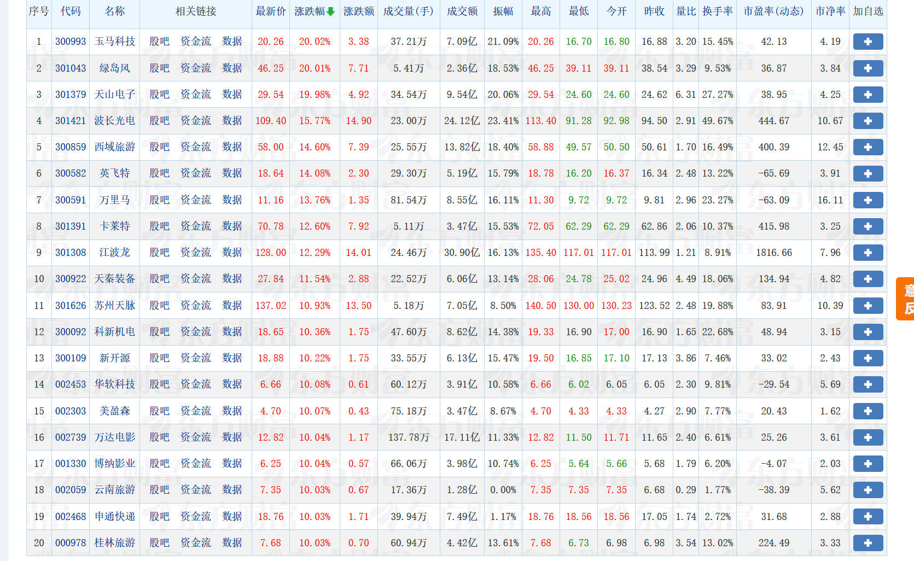

# 系统生成

```sql
"开发一个基于akshare的完整股票分析系统，采用前后端分离架构（前端和后端代码分别存放在独立文件夹中）。系统需包含以下功能模块：1) 各数据类型独立页面展示；2) 实时数据更新机制；3) 基于指定路径的数据库配置文件(@/C:\d:\daima\akshare\superbase.txt)进行数据库连接；4) 统一的前后端UI风格设计；5) 用户登录认证功能。技术要求：后端使用Python框架处理akshare数据接口，前端采用现代JavaScript框架实现动态交互，所有数据页面需实现自动刷新功能以保证UI与数据库同步。最终成果需通过截图形式展示系统界面和功能实现效果。"
```




> 更新: 2025-09-19 14:22:45  
> 原文: <https://www.yuque.com/lixinsi/ezlsss/rui1dsqlwn6eggyn>