# Demo

### NO.1 功能需求：
#### 1.用户登入
1.1 登入框包括用户名，密码。记住密码，注册功能，用户分为三种用户，管理员，老师，裁判员，学生代表四种类型。

#### 1.2 学生端
1.3 学生端用户登入

登入页面有 6 个模块可以选择

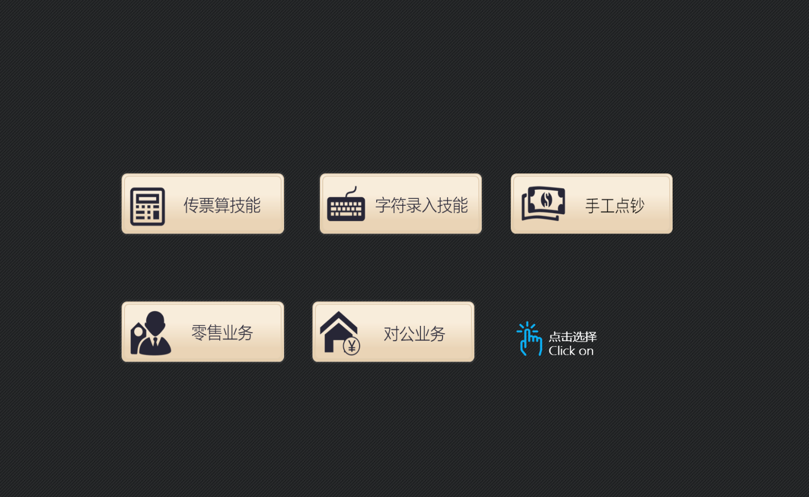

### 2.模块一：系统管理使用 admin 用户登入管理员界面，其中包括练习手工卷管理，翻打传票管理，字符录入管理，考核任务管理，考核成绩管理，考核测评任务。
##### 2.1 系统管理包括用户的网点新增，修改，删除，网点查询。
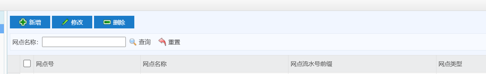

##### 2.2 系统管理中的培训班级管理班级新增，修改，删除，班级查询，网点查询
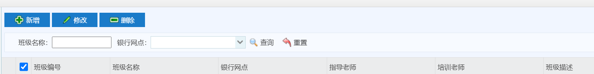

##### 2.3 系统管理学生新增，修改，删除，批量新增，批量删除，搜索删除，导入 execl 模板增加用户，导出 execl 用户数据
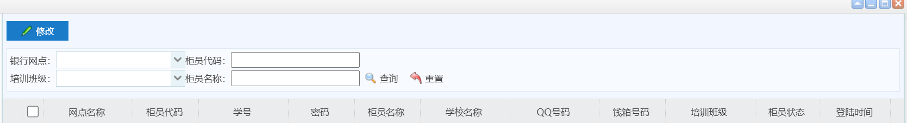

##### 2.4 系统管理修改密码
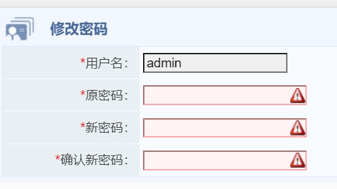

### 3.模块二：练习手工卷管理
##### 3.1 管理员端包括手工卷设置里面含有新增，修改，删除，激活，关闭激活，批量删除，搜索删除。
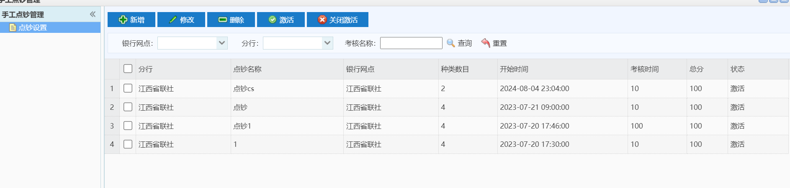

##### 3.2 新增按钮弹出，是否时间加分，学生端数量以及数值全队的情况下，每提前一秒增加 0.01 分
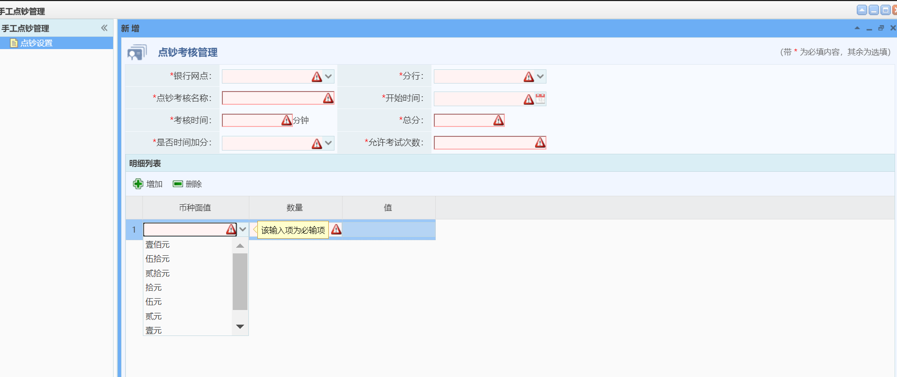

##### 3.3 币种面值可以选择内置，数量必填，填完数值自动计算，明细列表有删除和增加功能
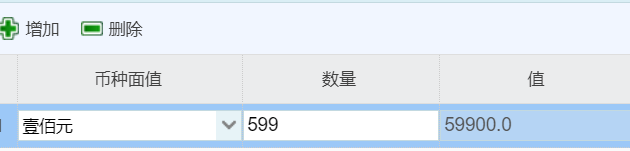

##### 3.4 页面设置完后有保存和重置功能，设置无误点击保存显示保存成功，否则显示保存失败。保存成功后手工卷设置显示设置考核，并且状态未激活。点击激活，学员端可以显示设置信息
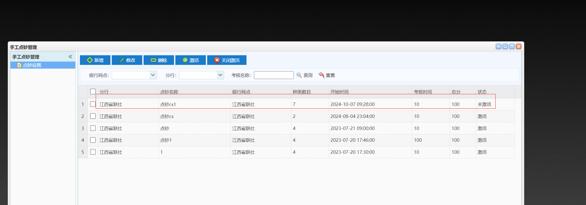

##### 3.5 学生端
点击手工点钞图标，跳转到下一个页面。

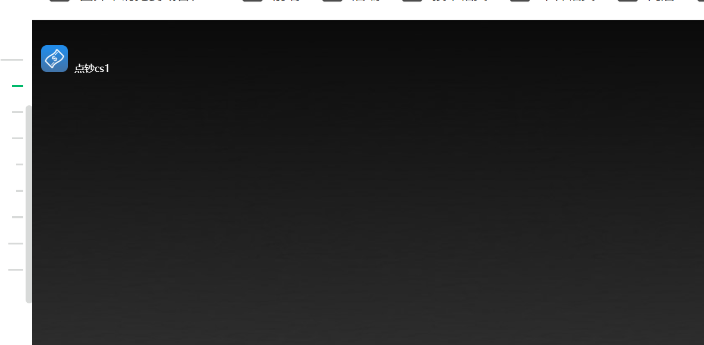

点击点钞 cs1 跳转到考核界面，以及显示登入账号，姓名，单位。对应输入管理员预制好的张数，以及总和填入表单，倒计时需要取服务器时间，前端页面都是取服务器时间，倒计时结束后，自动提交，考试设置 1 次后改学生无法登入系统。

##### 3.6 倒计时结束后裁判员登入，进行扣分，不扣分填 0 或者不填，扣分有加分则 不算加分 100 分扣除分数最后得分。
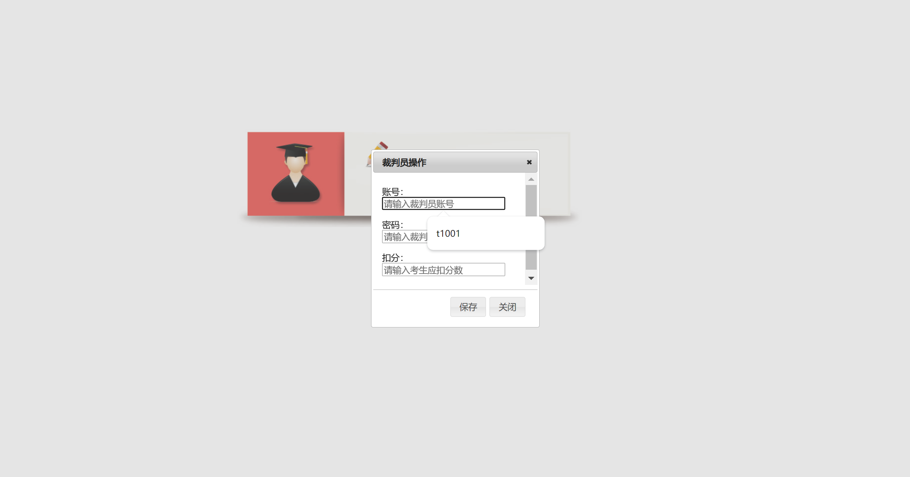

### 4.模块三：翻打传票管理
##### 4.1 管理员端包括手工卷设置里面含有新增，修改，删除，激活，关闭激活，查看答案明细，导入传票 exele 模板，导出传票模板，答案设置模板校验，批量删除，搜索删除。
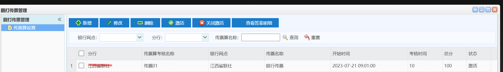

##### 4.2 新增按钮弹出，是否时间加分，学生端数量以及数值全队的情况下，每提前一秒增加 0.01 分。传票类型内置 ABCDEFJHIJ,开始值 0-99 页码，结束值 0-99 页码
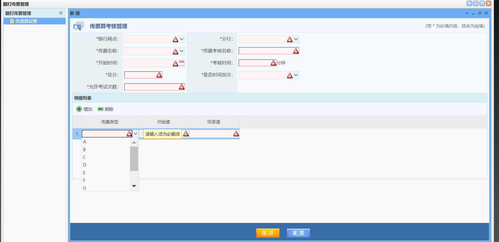

##### 4.3 传票类型可以选择内置，数量必填，填完数值自动计算，明细列表有删除和增加功能
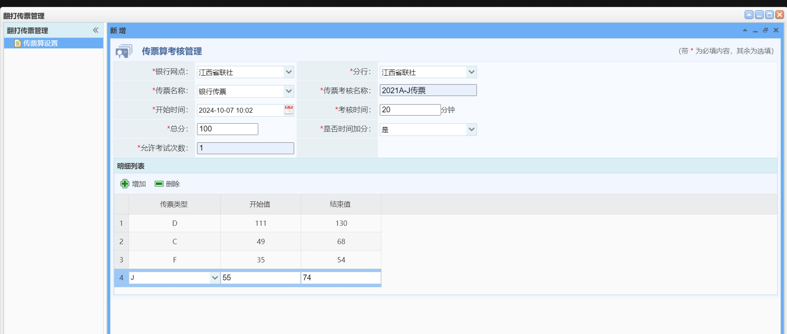

##### 4.4 页面设置完后有保存和重置功能，设置无误点击保存显示保存成功，否则显示保存失败。保存成功后传票设置显示设置考核，并且状态未激活。点击激活，学员端可以显示设置信息
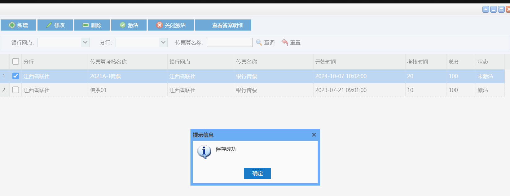

##### 4.5 学生端
点击传票图标，跳转到下一个页面。

 传票 跳转到考核界面，以及显示登入账号，姓名，单位。对应输入管理员预制好的张数，以及总和填入表单，倒计时需要取服务器时间，前端页面都是取服务器时间，倒计时结束后，自动提交，考试设置 1 次后改学生无法登入系统。

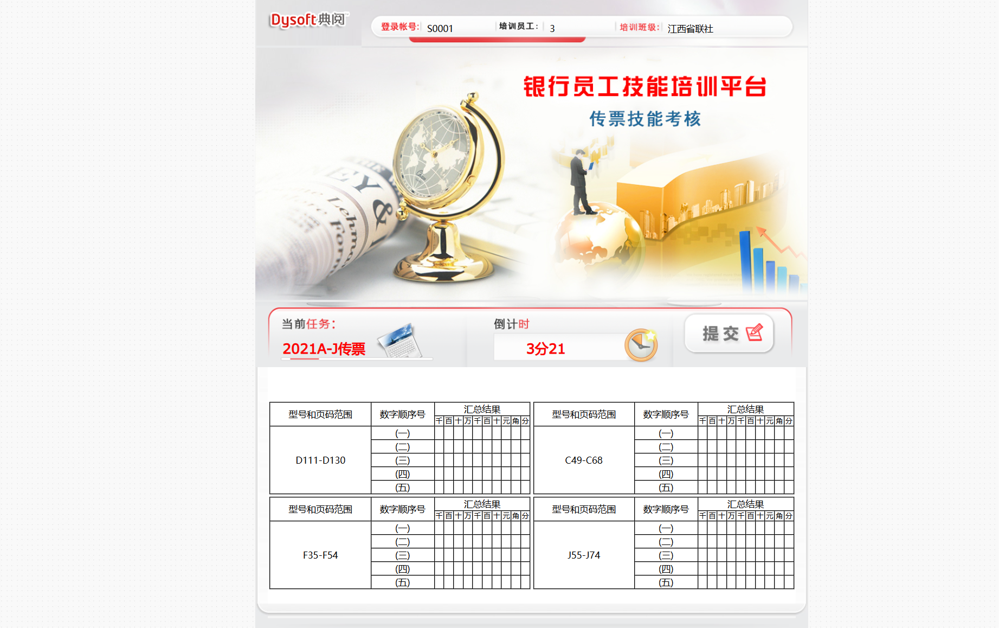

##### 4.6 倒计时结束后

##### 4.5 学生端
点击传票图标，跳转到下一个页面。

 传票 跳转到考核界面，以及显示登入账号，姓名，单位。对应输入管理员预制好的张数，以及总和填入表单，倒计时需要取服务器时间，前端页面都是取服务器时间，倒计时结束后，自动提交，考试设置 1 次后改学生无法登入系统。

##### 4.6 倒计时结束后

### 5.模块四：字符录入管理
##### 5.1 管理员端包括手工卷设置里面含有新增，修改，删除，激活，关闭激活，批量删除，搜索删除，模糊搜索以及定向搜索。
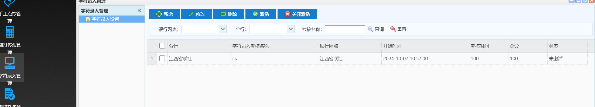

##### 5.2 新增按钮弹出，是否时间加分，学生端数量以及数值全队的情况下，每提前一秒增加 0.01 分。录入字符列表,设置录入字符个数，如果设置 1000 个字符，导入 txt 文件没有 1000 个则提示字符数不足。录入字符包括单列增加录入，删除，随机生成，选择文件（txt 格式）
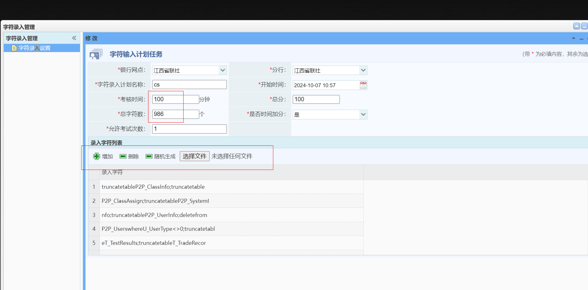

##### 5.3 页面设置完后有保存和重置功能，设置无误点击保存显示保存成功，否则显示保存失败。保存成功后传票设置显示设置考核，并且状态未激活。点击激活，学员端可以显示设置信息.
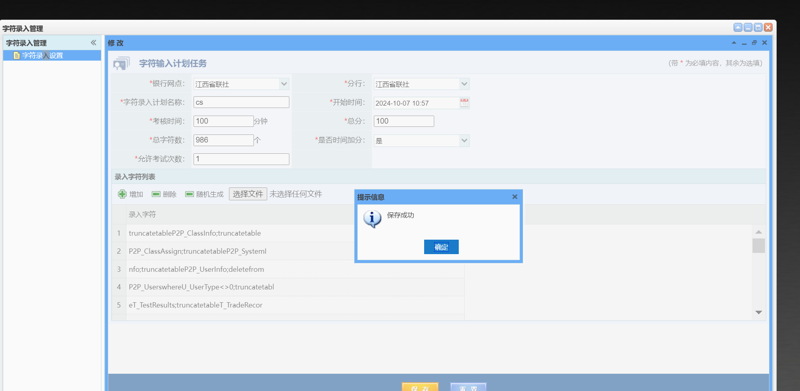

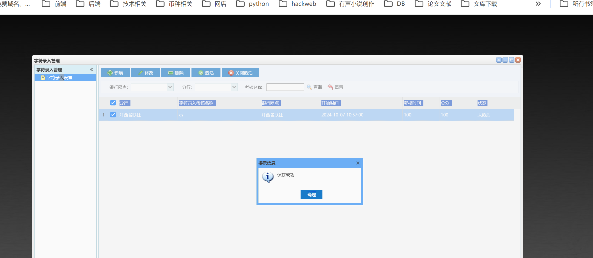

##### 5.5 学生端
点击字符录入图标，跳转到下一个页面。

 字符录入跳转到考核界面，以及显示登入账号，姓名，单位。对应输入管理员预制好的张数，以及总和填入表单，倒计时需要取服务器时间，前端页面都是取服务器时间，倒计时结束后，自动提交，考试设置 1 次后改学生无法登入系统。

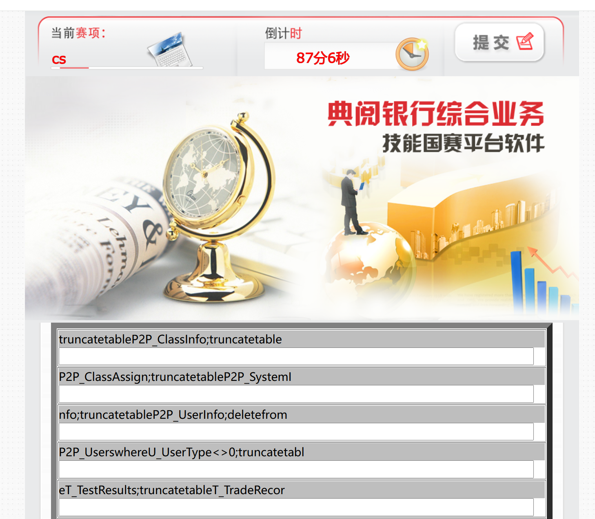

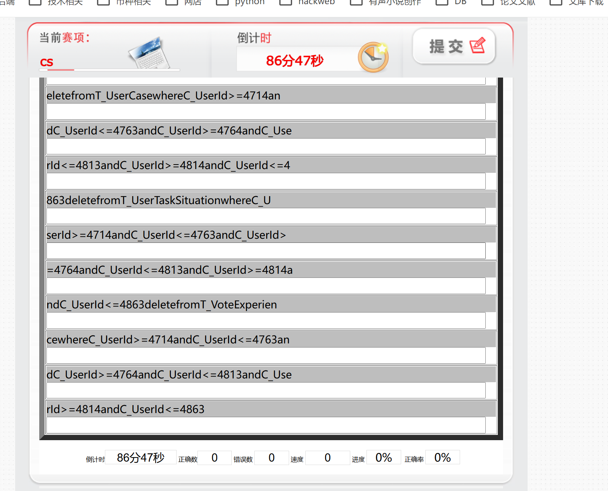

##### 5.6 倒计时结束后
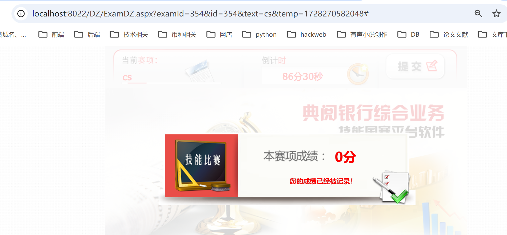

### 6.模块 五：考核任务管理
##### 6.1 管理员端考核任务管理包括考核计划管理，考核任务设置，考核时间设置。
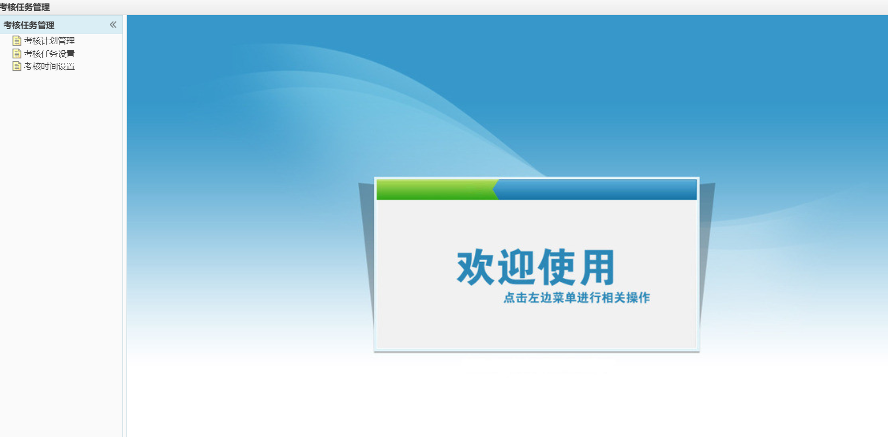

###### 6.1.1 考核计划管理，功能新增，修改，删除，考题预览，生成考题，导入考题，导出脚本，查询模糊查询。
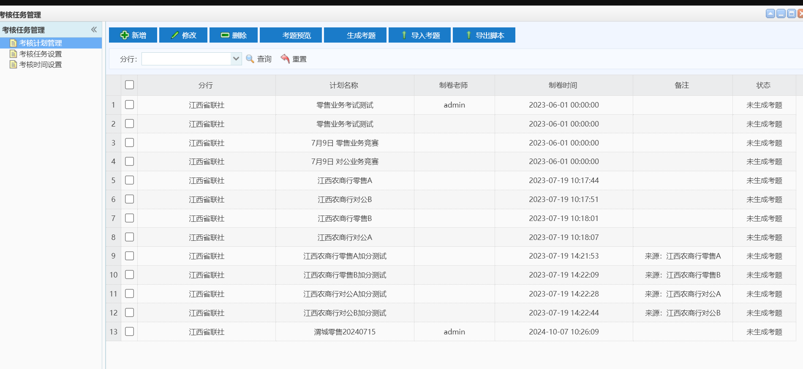

###### 6.1.2 考核任务设置，新增考核，修改，删除，赛题预览，在这里面进行题目的配置以及关联。
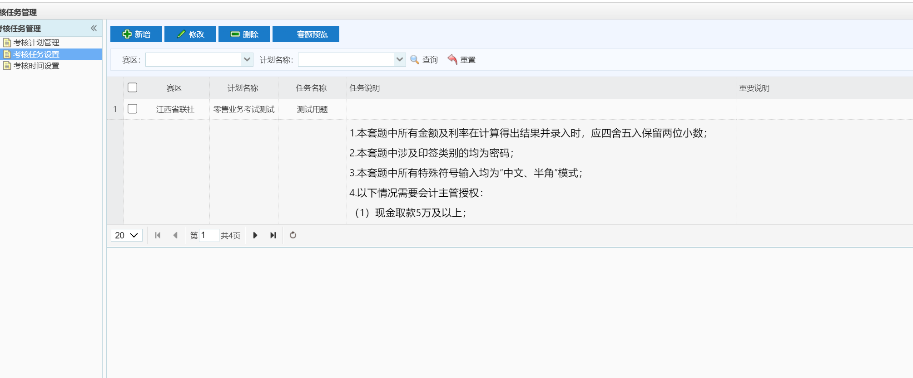

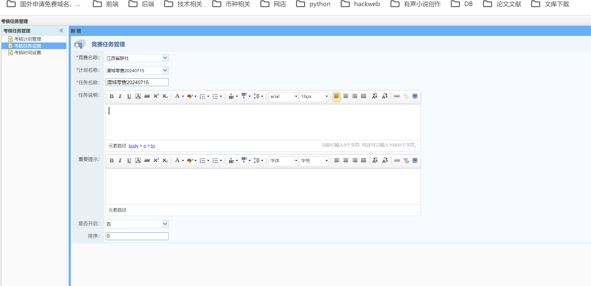

###### 6.1.3 考核时间设置页面有新增考核，修改，删除，激活，关闭激活，导出考题，设置完后有保存和重置功能，设置无误点击保存显示保存成功，否则显示保存失败。保存成功后传票设置显示设置考核，并且状态未激活。点击激活，学员端可以显示设置信息.
###### 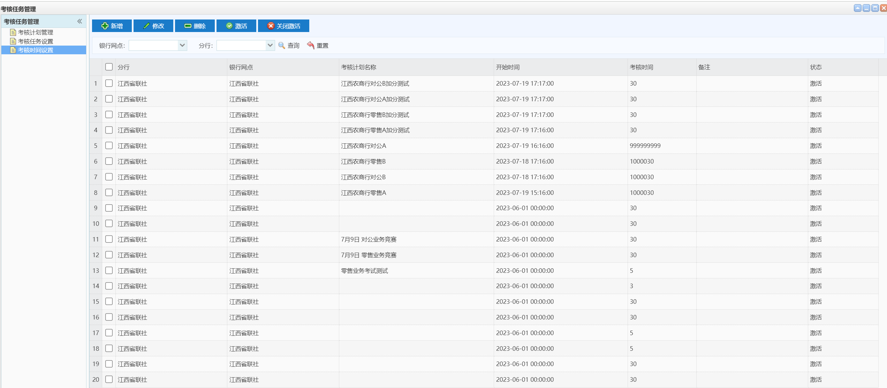
###### 
###### 
###### 
##### 6.2 学生端
点击字符录入图标，跳转到下一个页面。

 字符录入跳转到考核界面，以及显示登入账号，姓名，单位。对应输入管理员预制好的张数，以及总和填入表单，倒计时需要取服务器时间，前端页面都是取服务器时间，倒计时结束后，自动提交，考试设置 1 次后改学生无法登入系统。

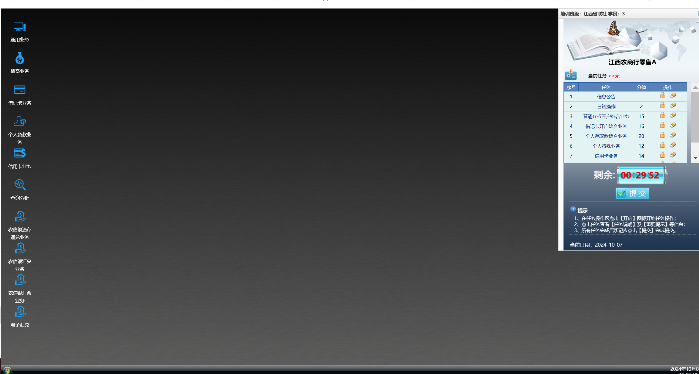

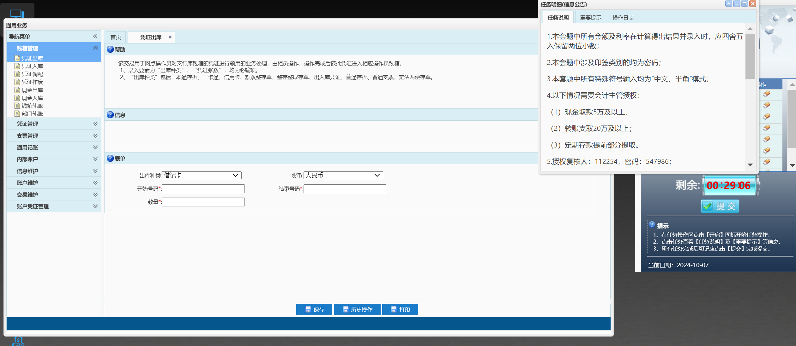

##### 5.6 倒计时结束后
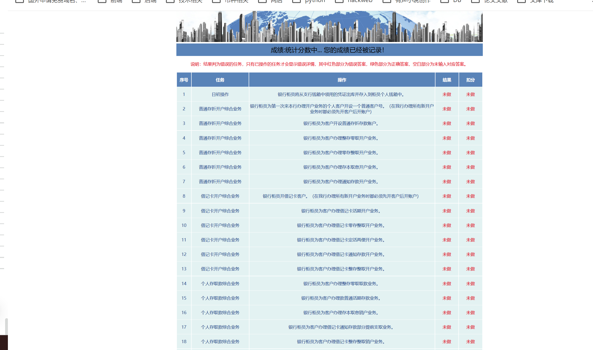

> 更新: 2024-10-07 12:02:21  
> 原文: <https://www.yuque.com/lixinsi/fo8k3i/alvw1a76wlcs45xo>